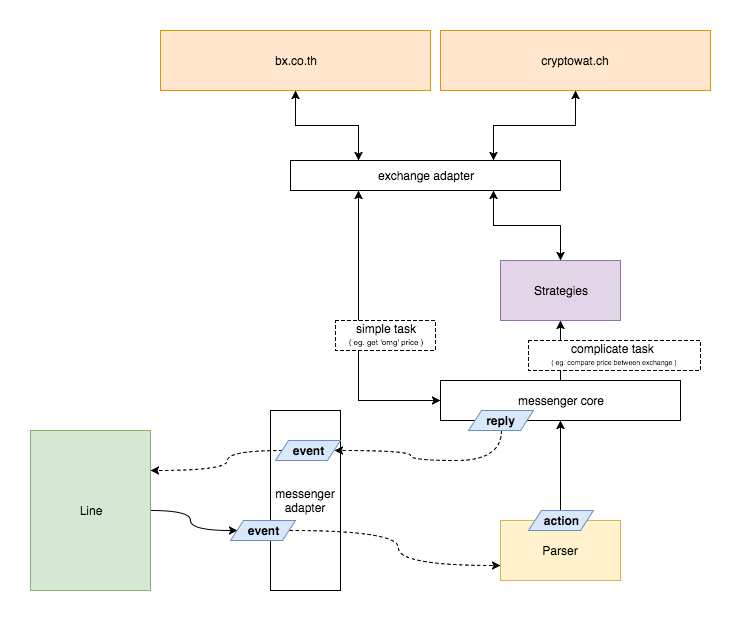

# Momoka, Cryptocurrency chatbot

Momoka is simple Crypto info bot, perform some simple task via messaging api

## Feature and Roadmap
- [x] Ask crypto currency price in THB and USD in realtime (via Bx.in.th and cryptowatch)
- [x] Ask for margin between Bx (TH) and Bitfinex (GLOBAL by cryptowatch)
- [x] Ask for foreign currency price
- [x] Subscribe price and alert
- [x] Subscribe by margin diff and alert
- [x] Price Data pool ( reduce API call load per request )
- [ ] User can create shortcut for any command
- [ ] User subscription
- [ ] Support Bitfinex API Directly ( current cryptowatch )
- [ ] Support Poloniex
- [ ] Support Bittrex

## Supported messenger
- [x] Line
- [ ] Facebook Messenger 
- [ ] Telegram

## Usage

# Demo
you can add friend with Momoka right now `@nat4157k`
> Note: Due to maintenance cost this demo just run on cheapest tier on DigitalOcean, I recommended you to run Momoka by yourself for self usage

## Command
You can ask Momoka for price information like `omgusd`, `margin omg` please goto [Command Guide document](./docs/guide.md) for more information

## Setup
- Create Line bussiness account
- Create Line Bot account and setup webhook in Line management
- create .env file from .env.example
- run service `npm run dev`

## Architecture
Momoka bot create with a simple design pattern (see below)

 

## Donate
*BTC*: `12UjMPBdMTRXboHDL2wrbZvZxFMH1uXnv6`

*OMG or ETH*: `0x962B0F5AE1976A9ddE8880503d65088b25E0f1E3`

## Patreon
[MomokaCryptoBot Pateron page](https://www.patreon.com/momokacrypto)
